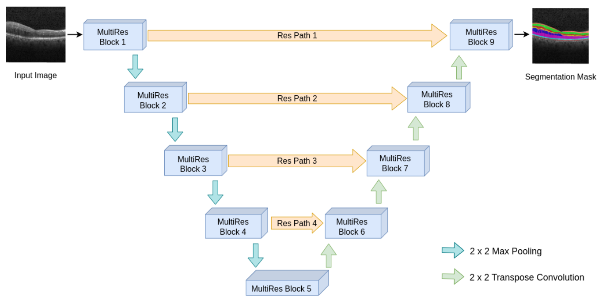
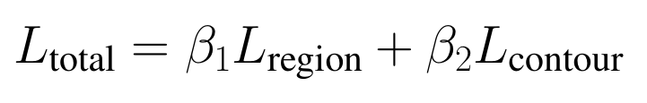
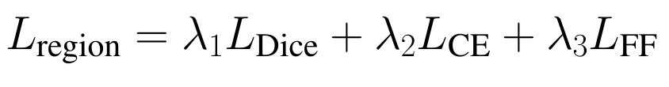
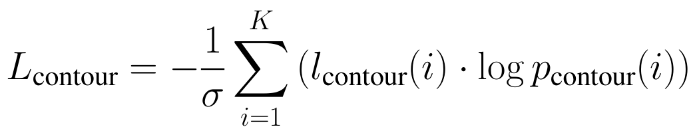
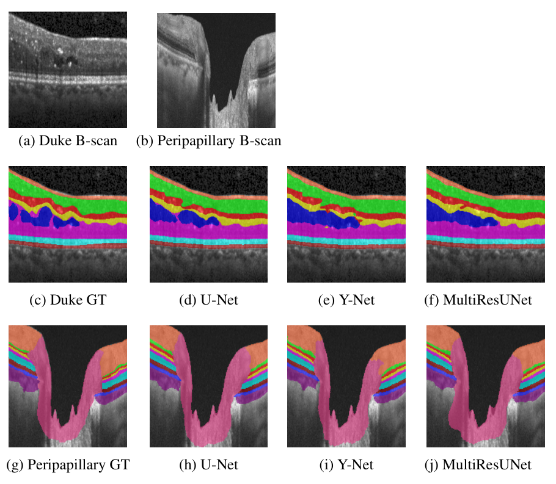
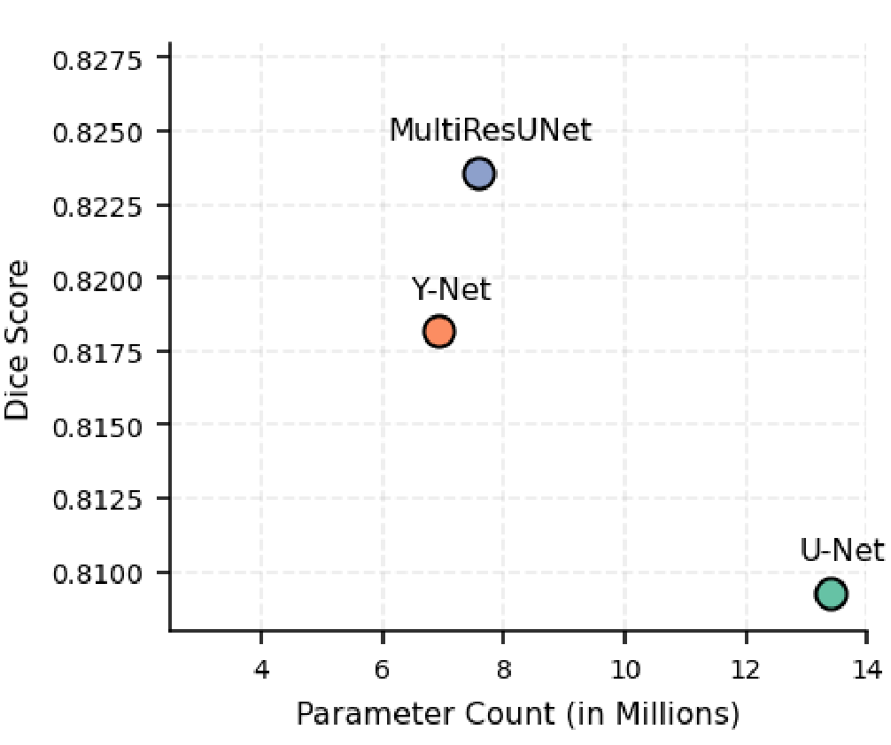
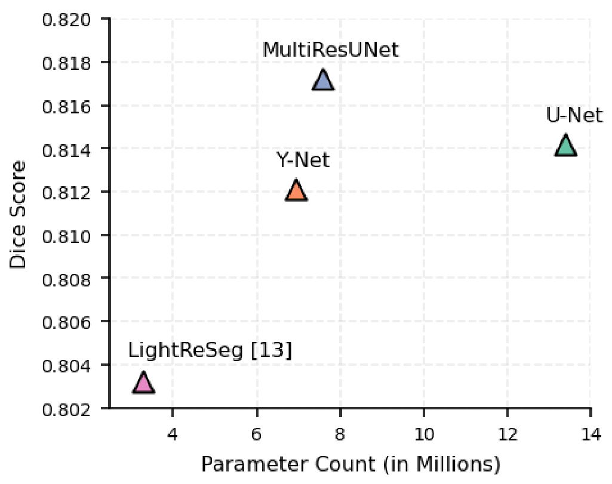

# An Efficient Lightweight U-Net Architecture For Retinal Layer Segmentation In OCT Images

**Akhil Lal P.P., Deepthi V.R., Dr. Sudeep P.V., Dr. Sreelekha G.**  
National Institute of Technology Calicut  
📌 Presented at AIML Systems Conference 2025 

---

## 🧠 Introduction

- Retinal diseases such as Age-related Macular Degeneration (AMD), Diabetic Macular Edema (DME), among others, cause pathological changes in retinal layers, serving as biomarkers for diagnosis and monitoring.
- High-resolution OCT images enable retinal layer analysis, but manual evaluation is time-consuming, subjective, and impractical at scale.
- Deep learning models, including U-Net and its extensions, provide automated segmentation critical for accurate diagnosis.
- Portable and handheld OCT devices for point-of-care screening and teleophthalmology demand lightweight, efficient, and robust models that perform well across diverse imaging conditions.

---

## 💡 Our Contribution

In this work, we evaluate and enhance the performance of **MultiResUNet**, an extension of U-Net for automated segmentation of retinal layers and fluid regions in SD-OCT images using the Duke DME and Peripapillary datasets.

### Key Contributions:

- Extended MultiResUNet for the first time in retinal OCT layer segmentation with task-specific optimization.
- Tuned the filter scaling parameter (**α**) to enhance performance.
- Integrated a composite loss function combining region-based and contour-based terms.
- Performed comprehensive comparison with:
  - U-Net
  - Y-Net
  - LightReSeg
- Evaluated on:
  - Duke DME dataset
  - Peripapillary dataset

---

## ⚙️ Proposed Methodology

- Adopted MultiResUNet for retinal layer segmentation due to its effectiveness in:
  - Multi-scale feature extraction
  - Reduced semantic gap
 

### Architecture Highlights:

- **MultiRes Blocks**:
  - Capture multi-scale features
  - Use stacked 3×3 convolutions to approximate larger receptive fields
- **ResPaths**:
  - Reduce semantic gap between encoder and decoder
- **Scaling Parameter (α)**:
  - Controls number of filters
  - Tuned for optimal performance

---

## 🧪 Loss Function

The model uses a composite loss combining region and contour supervision:

### Total Loss: 

### Region Loss: 

### Contour Loss: 

## 📊 Results

### 🔍 Qualitative Results

### ⏱️ Inference Time

| Model          | Duke DME (ms) | Peripapillary (ms) |
|----------------|--------------|--------------------|
| Y-Net          | 32.98        | 32.96              |
| MultiResUNet   | 63.61        | 63.68              |
| U-Net          | 59.44        | 59.42              |

### 📈 Model Complexity vs Performance

- Duke dataset:

- Peripapillary dataset

## ✅ Conclusion

- The proposed model achieved the highest mean Dice score, pixel accuracy, and balanced accuracy when compared to other methods such as U-Net and Y-Net.

- Our model uses **43.4% fewer parameters than U-Net** and improves Dice scores by:
  - **+1.77%** on the Duke DME dataset  
  - **+0.37%** on the Peripapillary dataset  

- Although the proposed model is more complex than the lightweight model LightReSeg, its segmentation performance is significantly higher.

- This MultiResUNet variant achieves an effective balance between accuracy and computational efficiency, making it a promising solution for retinal OCT layer segmentation in clinical environments.

---

## 📚 References

[1] J. E. Kim, *Exploring neovascular AMD and DME*, 2022.  
[2] P. Romero-Aroca, *Targeting DME pathophysiology*, 2010.  
[3] U-Net – Ronneberger et al., 2015.  
[4] MultiResUNet – Ibtehaz et al., 2020.  
[5] Duke DME Dataset – Chiu et al., 2015.  
[6] Peripapillary Dataset – Li et al., 2021.  
[7] Y-Net – Farshad et al., 2022.  
[8] LightReSeg – He et al., 2024.  
