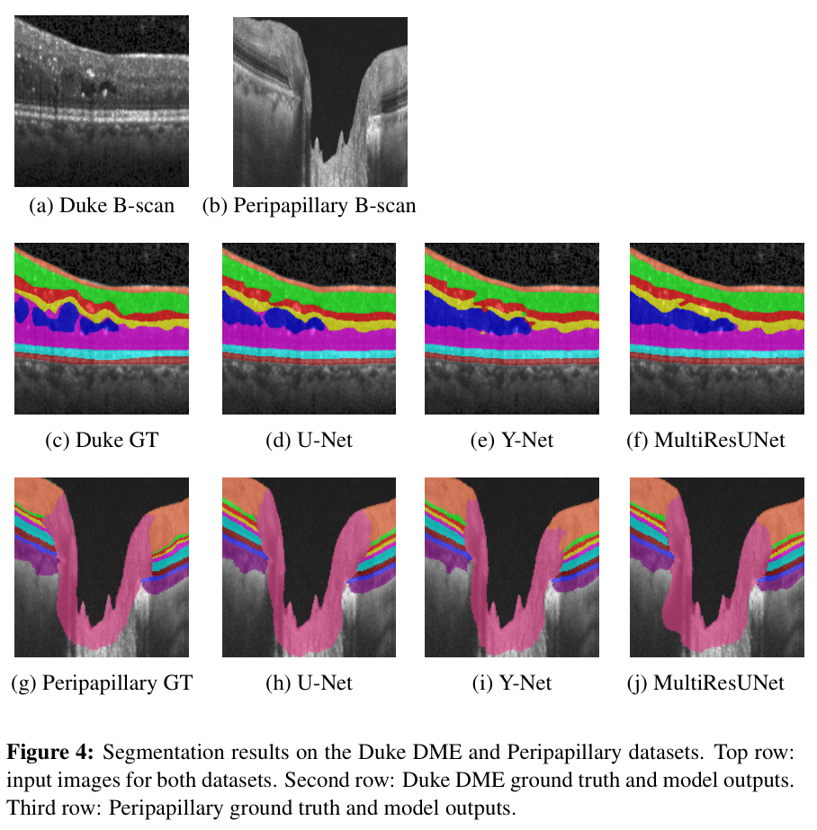

# An Efficient Lightweight U-Net Architecture For Retinal Layer Segmentation In OCT Images

**Akhil Lal P.P., Deepthi V.R., Dr. Sudeep P.V., Dr. Sreelekha G.**  
National Institute of Technology Calicut  
📌 Presented at AIML Systems Conference 2025 

---

## 🧠 Introduction

- Retinal diseases such as Age-related Macular Degeneration (AMD), Diabetic Macular Edema (DME), among others, cause pathological changes in retinal layers, serving as biomarkers for diagnosis and monitoring.
- High-resolution OCT images enable retinal layer analysis, but manual evaluation is time-consuming, subjective, and impractical at scale.
- Deep learning models, including U-Net and its extensions, provide automated segmentation critical for accurate diagnosis.
- Portable and handheld OCT devices for point-of-care screening and teleophthalmology demand lightweight, efficient, and robust models that perform well across diverse imaging conditions.

---

## 💡 Our Contribution

In this work, we evaluate and enhance the performance of **MultiResUNet**, an extension of U-Net for automated segmentation of retinal layers and fluid regions in SD-OCT images using the Duke DME and Peripapillary datasets.

### Key Contributions:

- Extended MultiResUNet for the first time in retinal OCT layer segmentation with task-specific optimization.
- Tuned the filter scaling parameter (**α**) to enhance performance.
- Integrated a composite loss function combining region-based and contour-based terms.
- Performed comprehensive comparison with:
  - U-Net
  - Y-Net
  - LightReSeg
- Evaluated on:
  - Duke DME dataset
  - Peripapillary dataset

---

## ⚙️ Proposed Methodology

- Adopted MultiResUNet for retinal layer segmentation due to its effectiveness in:
  - Multi-scale feature extraction
  - Reduced semantic gap

### Architecture Highlights:

- **MultiRes Blocks**:
  - Capture multi-scale features
  - Use stacked 3×3 convolutions to approximate larger receptive fields
- **ResPaths**:
  - Reduce semantic gap between encoder and decoder
- **Scaling Parameter (α)**:
  - Controls number of filters
  - Tuned for optimal performance

---

## 🧪 Loss Function

The model uses a composite loss combining region and contour supervision:

### Total Loss: L_total = β1 * L_region + β2 * L_contour

### Region Loss: L_region = λ1 * Dice Loss + λ2 * Cross Entropy Loss + λ3 * Focal Frequency Loss

### Contour Loss: L_contour = - (1/σ) Σ [l_contour(i) * log(p_contour(i))]

- Enhances boundary precision using edge-aware supervision

## 📊 Results

### 🔍 Qualitative Results

- Segmentation performed on:
  - Duke DME dataset
  - Peripapillary dataset

📌 (Add images in `/images` folder and link here)

/images/duke_sample.png
/images/peripapillary_sample.png

### ⏱️ Inference Time

| Model          | Duke DME (ms) | Peripapillary (ms) |
|----------------|--------------|--------------------|
| Y-Net          | 32.98        | 32.96              |
| MultiResUNet   | 63.61        | 63.68              |
| U-Net          | 59.44        | 59.42              |

### 📈 Model Complexity vs Performance

- Analysis performed on:
  - Model size vs Mean Dice Score

📌 (Add plots in `/images`)

/images/duke_plot.png
/images/peri_plot.png

## ✅ Conclusion

- Achieved highest:
  - Mean Dice Score
  - Pixel Accuracy
  - Balanced Accuracy

- Improvements:
  - **43.4% fewer parameters than U-Net**
  - Dice improvement:
    - +1.77% (Duke DME)
    - +0.37% (Peripapillary)

- Compared to LightReSeg:
  - Higher segmentation performance

- Final Outcome:
  - Efficient balance between accuracy and computational complexity
  - Suitable for clinical and real-time applications

---

## 📚 References

- U-Net (Ronneberger et al.)
- MultiResUNet (Ibtehaz et al.)
- Y-Net
- LightReSeg
- Duke DME Dataset
- Peripapillary Dataset
